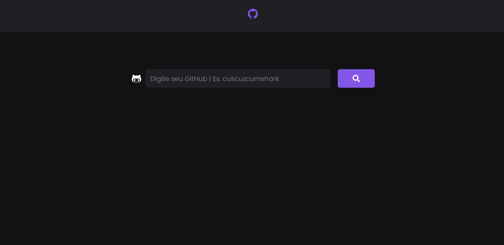

# YourGit

O YourGit é uma plataforma destinada a retornar seu dados da API do github

Link: https://yourgit.netlify.app/

Essa projeto foi desenvolvimento em ReactJs e tem como funcionalidade a busca de dados dos usuários do GitHub e retornar na tela, para isso basta informar o nome do usuário e clicar em pesquisar.

API GitHub utilizada (https://api.github.com/users/)

  

